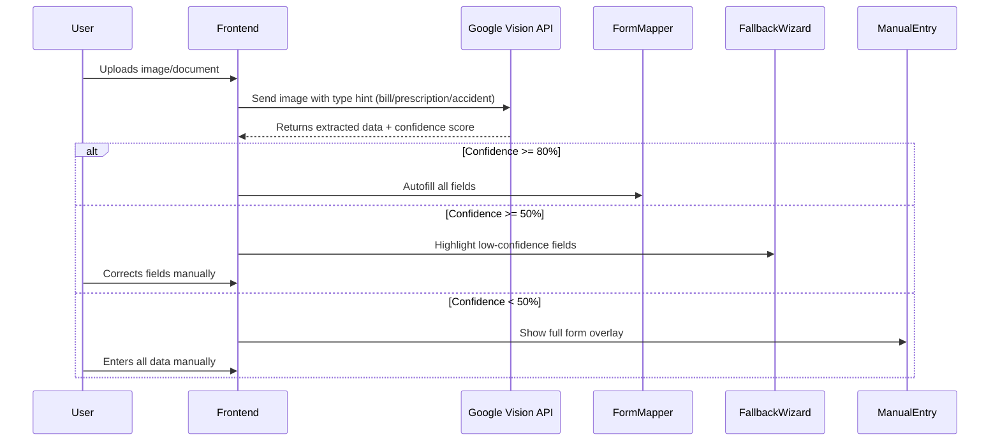

# Frontend Architecture Documentation: ClaimAssist Pro  
*Mobile-first responsive web app for insurance claims processing*  

## 1. Core Technologies  
| Component        | Technology       | Version | Justification                                                                 |  
|------------------|------------------|---------|-------------------------------------------------------------------------------|  
| **Framework**    | React.js         | 18.2.0  | Component reusability + fast rendering for dynamic claim flows                |  
| **UI Library**   | Material-UI (MUI)| 5.14.18 | Pre-built accessible components for insurance use cases                       |  
| **Styling**      | Tailwind CSS     | 3.3.3   | Rapid mobile-responsive prototyping with utility classes                      |  
| **State Mgmt**   | Zustand          | 4.3.8   | Lightweight global state for complex claim forms                              |  
| **Navigation**   | React Router     | 6.15.0  | Seamless transitions between claim steps                                      |  
| **Form Handling**| React Hook Form  | 7.45.1  | Efficient dynamic form management with validation                             |  

## 2. Component Structure  
```plaintext
src/
├── components/
│   ├── voice/
│   │   ├── VoiceRecorder.jsx      # Multilingual voice input with waveform visualization
│   │   ├── KeywordHighlighter.jsx # Real-time accident/hospital/fever detection
│   │   └── LanguageSelector.jsx   # Dynamic language switcher (10+ Indian languages)
│   ├── ocr/
│   │   ├── ImageUploader.jsx      # Drag-n-drop with preview and retry options
│   │   ├── OCRConfidenceBadge.jsx # Visual confidence indicator (high/medium/low)
│   │   └── OCRFallbackWizard.jsx  # 3-step manual correction flow
│   ├── claims/
│   │   ├── AutoFormGenerator.jsx  # Dynamic form builder from JSON schema
│   │   ├── FieldMapper.jsx        # Maps voice/OCR data to form fields
│   │   └── PayoutSimulator.jsx    # Visual gap analysis with fraud warnings
│   ├── copilot/
│   │   ├── EscalationDialog.jsx   # Triple-confirmation agent handoff
│   │   └── LiveAgentBridge.jsx    # Seamless chat transfer interface
│   └── shared/
│       ├── ProgressStepper.jsx    # 5-step claim tracker
│       └── WhatsAppExport.jsx     # Claim status sharing via Twilio API
├── layouts/
│   ├── MainLayout.jsx             # Global navigation + responsive sidebar
│   └── ClaimLayout.jsx            # Dedicated claim processing workspace
└── pages/
    ├── HomePage.jsx               # Voice/image entry point
    ├── FormPage.jsx               # Dynamic claim form
    ├── ReviewPage.jsx             # Simulation results & submission
    └── DashboardPage.jsx          # Claim tracking + document export

## 3. Key User Interfaces  

### A. Voice Input Interface  
```jsx
// VoiceRecorder.jsx
<VoiceContainer>
  <WaveformVisualizer /> {/* wavesurfer.js integration */}
  <LanguageBadge language={currentLang} /> {/* Auto-detected or user-selected */}
  <RecordingTimer />
  <KeywordTags 
    keywords={['accident', 'hospital', 'fever']} 
    transcript={transcript}
  />
  <ControlBar>
    <RecordButton />
    <PauseOnSilenceToggle /> {/* Auto-pause after 2s silence */}
    <SubmitDisabledUntil keywordsPresent={minKeywords} />
  </ControlBar>
</VoiceContainer>
```

### B. Document Upload Flow  


## 4. State Management Strategy  

### Zustand Store Configuration  
```javascript
// src/stores/claimStore.js
import create from 'zustand';

const useClaimStore = create((set) => ({
  // Voice processing state
  audioBlob: null,
  transcript: '',
  detectedKeywords: [],
  language: 'en-IN',
  
  // OCR processing state
  uploadedFiles: [],
  extractedData: {},
  confidenceScore: 0,
  needsManualReview: false,
  
  // Claim form state
  claimForm: {
    claimType: 'medical',
    amount: 0,
    items: [],
    location: null,
    // ...other fields
  },
  
  // Simulation results
  simulationResult: null,
  
  // Actions
  setTranscript: (text) => set({ transcript: text }),
  setKeywords: (keywords) => set({ detectedKeywords: keywords }),
  triggerFallback: () => set({ needsManualReview: true }),
  updateFormField: (field, value) => 
    set(state => ({ 
      claimForm: { ...state.claimForm, [field]: value } 
    })),
}));
```

## 5. Critical UI Specifications  

### 1. Claim Initiation Screen (HomePage)  
- **Layout Strategy**:  
  - Mobile: Vertical stack (Voice top, Upload bottom)  
  - Desktop: Split 60/40 with resizable panels  
- **Core Components**:  
  - `VoiceRecorder` with real-time translation toggle  
  - `ImageUploader` supporting:  
    - File types: JPG/PNG/PDF  
    - Max size: 10MB  
    - EXIF rotation correction  

### 2. Dynamic Form Screen (FormPage)  
| Field Type          | Styling Rules                     | Behavior                              |  
|---------------------|-----------------------------------|---------------------------------------|  
| Auto-filled         | Green border + check icon         | Editable but pre-validated            |  
| Low-confidence      | Yellow border + warning icon      | Focus auto-scroll + helper text       |  
| Manual entry        | Blue border + edit icon           | Standard input with validation        |  
| Simulation preview  | Right-side sticky panel           | Live updates on field change          |  

### 3. Copilot Escalation Flow  
```jsx
<EscalationFlow 
  steps={[
    { 
      title: "AI Assistance", 
      content: <DialogflowChatWindow />,
      confirmText: "Still need help?" 
    },
    { 
      title: "Agent Confirmation", 
      content: "Transfer will take 5-7 minutes. Continue?",
      confirmText: "Yes, transfer me" 
    },
    { 
      title: "Final Verification", 
      content: "You'll lose AI context. Absolutely sure?",
      confirmText: "Connect to agent now",
      variant: "contained",
      color: "error"
    }
  ]}
/>
```

## 6. Third-Party Libraries  
| Library            | Version | Purpose                                                                 |  
|--------------------|---------|-------------------------------------------------------------------------|  
| `react-webcam`     | 7.0.0   | Document scanning directly from device camera                           |  
| `wavesurfer.js`    | 6.6.3   | Voice waveform visualization with silence detection                     |  
| `react-dropzone`   | 14.3.0  | Drag-n-drop upload with EXIF orientation handling                       |  
| `react-toastify`   | 9.1.3   | Error notifications for OCR/voice failures                              |  
| `react-intl`       | 6.2.9   | Multilingual support for 10+ Indian languages                           |  
| `react-json-view`  | 1.21.3  | Debug view for claim data (dev mode only)                               |  
| `react-leaflet`    | 4.10.2  | Location mapping for accident claims                                    |  

## 7. Responsive Behavior  
| Breakpoint      | Layout Strategy                          | Special Considerations                     |  
|-----------------|------------------------------------------|--------------------------------------------|  
| < 640px (Mobile)| Vertical stacking                        | Voice recorder full-width                  |  
| 640-1024px (Tab)| Split 50/50 with collapsible panels      | Dynamic form in modal overlay              |  
| > 1024px (Desktop)| Fixed sidebar + expanding workspace    | Simulation panel always visible            |  

## 8. Accessibility Compliance  
- WCAG 2.1 AA Standards  
- Screen reader support for all form fields  
- Color contrast ratio ≥ 4.5:1  
- Keyboard navigable claim flow  
- ARIA labels for all interactive elements  

